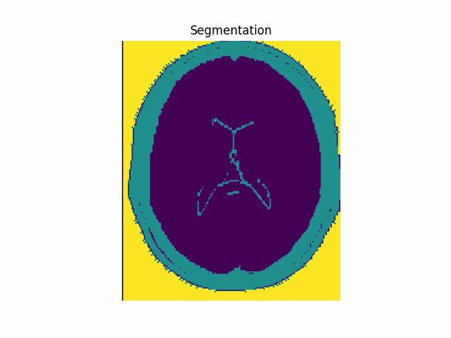
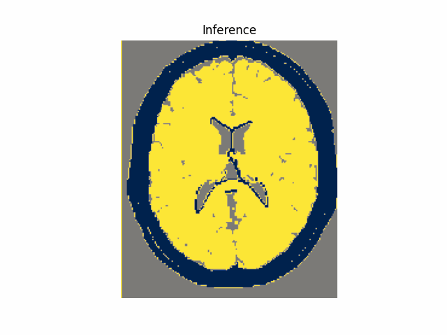

# EM-GMM Image Segmentation

This project implements an EM-GMM (Expectation Maximization Gaussian Mixture Model) for medical image segmentation, particularly focused on brain MRI scans. The segmentation process involves removing background noise, preprocessing the images, and applying the EM-GMM algorithm to cluster regions of interest (e.g., brain, skull, and other regions). The results are visualized as segmentation outputs, including LL (Log-Likelihood) vs. iterations, and GIFs of the segmentation progress.

## Project Structure

The project is organized as follows:

  `````markdown
EM-GMM-Image-Segmentation/
│
├── data/                     # Folder to store sample images (CT, MRI, etc.)
│   ├── brainmri1.png         # Example medical image for testing
│   ├── brainmri2.png         # Additional image for testing
│   ├── brainmri3.png         # Additional image for testing
│   └── mris.png              # Another image for testing
│
├── artifacts/                # Folder to store generated artifacts (e.g., GIFs, plots)
│   └── gmm_inference.gif     # GIF showing the inference process
│
├── scripts/                  # Folder containing the project’s Python scripts
│   ├── preprocessing.py      # Preprocessing steps before EM-GMM iteration
│   ├── run_inference_in_order_to_create_gif.py  # Running inference to generate inference images and LL vs. iterations plot
│   └── training.py           # Model training loop and generating cluster alignments
│
├── requirements.txt          # List of required Python packages
├── README.md                 # Project overview and instructions
└── LICENSE                   # License for the project (e.g., MIT)
  `````


## Overview

This project implements a medical image segmentation pipeline using the EM-GMM algorithm. It is specifically tailored for MRI scans of the brain, but can be adapted for other types of medical images.

Key steps in the project include:
- **Preprocessing**: Removing background noise and normalizing the images.
- **Model Training**: Training the EM-GMM model to segment the image into 3 distinct regions.
- **Inference**: Running the trained model to create segmented images and visualize the results.
- **Visualization**: Generating visual output, including a GIF of the inference process and a plot of Log-Likelihood (LL) vs. iterations.

## Requirements

The following Python packages are required to run this project:

- numpy
- opencv-python
- scikit-learn
- matplotlib

These dependencies are listed in the `requirements.txt` file.

You can install them using the following command:

```bash
pip install -r requirements.txt
```

# How to Use

1. **Install Dependencies**
   Clone the repository and install the required dependencies:

```bash
git clone [<repository_url>](https://github.com/Malek-Dinari/EM-GMM_brain_mri_segmentation.git)
cd EM-GMM-Image-Segmentation
pip install -r requirements.txt
```


2. **Preprocess the Images**

   Before running the EM-GMM segmentation, preprocess the images to remove background and normalize them. This is done in preprocessing.py. You can modify this script if you need to adjust the preprocessing pipeline.

  ```bash
   python preprocessing.py
  ```

3. **Train the EM-GMM Model**

   ```bash
   python training.py
    ```

>>> The training process is visualized as a GIF:




4. **Run Inference and Generate GIF**

  ```bash
   python run_inference_in_order_to_create_gif.py
  ```

> EM-GMM model inference on the 3 images

>>> The inference process is visualized as a GIF:




## License

  This project is licensed under the MIT License - see the LICENSE file for details.
